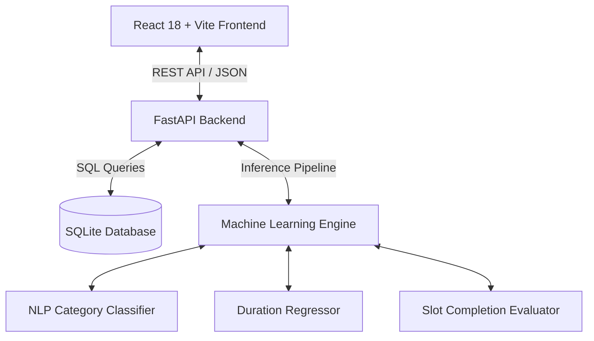
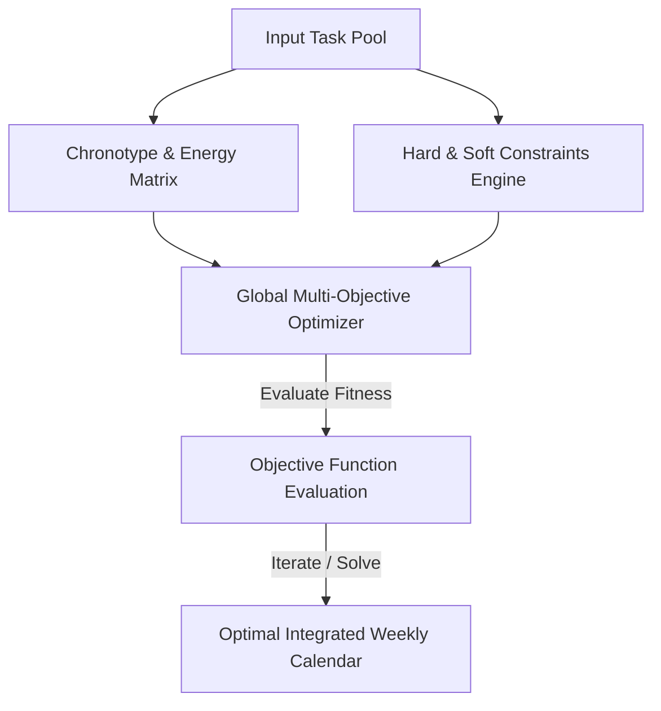

# ⚡ DayMind AI — Technical Overview, Architecture & Calendar Optimization Roadmap

---

## 📌 Executive Summary

**DayMind AI** is an intelligent, machine-learning-driven task scheduling and calendar management platform built to bridge the gap between static to-do lists and dynamic real-world productivity. Traditional calendar applications require users to manually plan, estimate, and fit tasks into rigid slots. DayMind AI automates this workflow using **Supervised Machine Learning (NLP, Regression, Classification)** and **Dynamic Dynamic Replanning Algorithms**.

This document serves as the **comprehensive technical specification**, **architectural overview**, **roadmap for the upcoming AI Calendar Optimization feature**, and **slide-by-slide technical presentation guide (for PPT presentations)**.

---

## 🏗️ 1. Project Overview & Core Value Proposition

### 1.1 The Problem Statement
Modern professionals and students face significant productivity friction:
1. **Manual Friction & Decision Fatigue**: Users spend 20–30 minutes daily manually organizing tasks, guessing time durations, and picking calendar slots.
2. **Static & Rigid Schedules**: Existing calendars (Google Calendar, Outlook) treat calendar blocks as static entries. When an urgent task or interruption occurs, the schedule breaks down, leading to missed deadlines and stress.
3. **Misalignment with Human Energy**: Tasks are placed without considering circadian energy cycles (e.g., placing high-focus coding or math tasks during post-lunch energy slumps).
4. **Poor Duration Estimation**: Humans under bias (Planning Fallacy) consistently underestimate task duration by 25–40%.

### 1.2 DayMind AI Solution
DayMind AI transforms raw free-text task prompts into an optimized, hour-by-hour weekly calendar and dynamic checklist:
- **Automatic NLP Classification**: Instantly categorizes free-text tasks into `academic`, `work`, `health`, `personal`, or `learning`.
- **ML Duration Regression**: Predicts realistic actual execution duration using trained historical regression models.
- **Slot Completion Probability**: Evaluates hour-by-hour calendar slots (Mon–Sun, 7:00 AM – 10:00 PM) to maximize completion likelihood.
- **Urgent Task Dynamic Replanning & Bumping**: Instantly accommodates unexpected high-priority tasks by bumping lower-priority flexible tasks to alternative optimal slots.

---

## 🛠️ 2. Comprehensive Technical Stack



### 2.1 Technology Matrix

| Layer | Technology / Framework | Key Responsibilities & Capabilities |
| :--- | :--- | :--- |
| **Frontend Framework** | **React 18 + Vite** | High-performance SPA with fast HMR, reactive state management |
| **UI Design System** | **Vanilla CSS + Glassmorphism** | Custom dark aurora theme, frosted glass cards, glow effects, responsive grid |
| **Icons & Visuals** | **Lucide React + Canvas Confetti** | Vector icon set, interactive micro-animations, completion effects |
| **Backend API** | **FastAPI (Python 3.10+)** | Asynchronous RESTful endpoints, Pydantic data validation, OpenAPI docs |
| **Server Runtime** | **Uvicorn** | High-concurrency ASGI Web Server |
| **Database** | **SQLite (`daymind.db`)** | Embedded, lightweight relational storage for single-user tasks & calendar events |
| **Machine Learning** | **Scikit-Learn, Pandas, NumPy** | Feature extraction, vectorization, model training, probabilistic scoring |
| **Model Persistence** | **Joblib** | Serialization/Deserialization of `.pkl` trained binary models |
| **Deployment Options** | **Docker / Vercel / Render** | Single-port containerization (`Dockerfile`) and serverless wrappers (`api/index.py`) |

---

## 🤖 3. Machine Learning Architecture & Technical Specs

DayMind AI employs three distinct supervised machine learning models trained on historical task data (`task_dataset.csv`).

```
                              ┌─────────────────────────────────────────┐
                              │           Raw User Task Prompt          │
                              └────────────────────┬────────────────────┘
                                                   │
                                     ┌─────────────┴─────────────┐
                                     ▼                           ▼
                        ┌─────────────────────────┐ ┌─────────────────────────┐
                        │   NLP Text Classifier   │ │   Duration Regressor    │
                        │ (TF-IDF + Logistic Reg) │ │ (RandomForestRegressor) │
                        └────────────┬────────────┘ └────────────┬────────────┘
                                     │                           │
                                     ▼                           ▼
                              Predicted Category         Predicted Actual Mins
                                     │                           │
                                     └─────────────┬─────────────┘
                                                   │
                                                   ▼
                                    ┌──────────────────────────────┐
                                    │ Slot Completion Evaluator    │
                                    │ (RandomForestClassifier)     │
                                    └──────────────┬───────────────┘
                                                   │
                                                   ▼
                                    Optimal Calendar Slot Picked
```

### 3.1 Model 1: NLP Text Category Classifier
- **Algorithm**: TF-IDF Vectorization ($1 \text{ to } 2\text{-gram}$) + Logistic Regression ($C=1.0$).
- **Objective**: Classify arbitrary text (e.g., *"Finish machine learning lab report"*) into 5 target categories: `academic`, `work`, `health`, `personal`, `learning`.
- **Performance Metric**: **100.0% Test Accuracy** on validation set.
- **Mathematical Formula**:
  $$\hat{y} = \arg\max_{c \in C} P(y = c \mid \mathbf{x}) = \arg\max_{c \in C} \frac{e^{\mathbf{w}_c^T \mathbf{x} + b_c}}{\sum_{j} e^{\mathbf{w}_j^T \mathbf{x} + b_j}}$$

### 3.2 Model 2: Task Duration Regressor
- **Algorithm**: Random Forest Regressor ($200 \text{ decision trees}$, `random_state=42`).
- **Objective**: Predict predicted actual execution duration in minutes given estimated duration, category, priority, and target time slot.
- **Performance Metric**: **MAE (Mean Absolute Error): 6.15 minutes** | **$R^2$ Score: 0.941**.
- **Features Used**: `category` (one-hot), `priority` (one-hot), `estimated_duration` (int), `day_of_week` (one-hot), `hour_slot` (int).

### 3.3 Model 3: Slot Completion Evaluator
- **Algorithm**: Random Forest Classifier ($200 \text{ decision trees}$, `max_depth=12`).
- **Objective**: Binary classification predicting whether a user will complete a task in a specific calendar slot ($1 = \text{Completed}$, $0 = \text{Missed}$).
- **Performance Metric**: **73.8% Test Accuracy**.
- **Slot Evaluation Function**:
  $$Score(\text{Task}, \text{Day}, \text{Hour}) = P(\text{Completion} = 1 \mid \mathbf{x}_{\text{slot}})$$

---

## ⚡ 4. Dynamic Urgent Replanning & Bumping Algorithm

When an urgent task arrives, the system triggers the **Self-Healing Replanning Engine** ([scheduler.py](file:///home/kishore/Projects/day-mind/scheduler.py) / [ml_engine.py](file:///home/kishore/Projects/day-mind/ml_engine.py)):

1. **Free Slot Discovery**: Searches for available free slots during user preferred hours (7:00 AM – 10:00 PM).
2. **Conflict Resolution**: If a free slot exists, the urgent task is scheduled immediately.
3. **Task Bumping Mechanism**:
   - If all slots are occupied, the engine evaluates all currently scheduled tasks.
   - It identifies tasks with `priority == 'low'` or `priority == 'medium'`.
   - It calculates a **Flexibility Score**:
     $$\text{Flexibility} = \frac{1 - \text{PriorityWeight}}{\text{CompletionProb}}$$
   - The task with the highest flexibility is **bumped** from its slot.
   - The urgent task claims the liberated slot.
   - The bumped task is automatically re-routed and rescheduled into the next best available slot across the week.
4. **Audit Trail**: Every bump event produces a structured audit log containing `bumped_task_id`, `original_slot`, `new_slot`, and `reason`.

---

## 🔮 5. Upcoming Feature: AI Calendar Optimization (Deep Dive)

### 5.1 Problem Statement
While the current engine optimizes individual task placement, real-world productivity demands **global week-level calendar optimization**. Current productivity tools (Google Calendar, Reclaim.ai, Motion, Clockwise) exhibit major shortcomings:
- **Heuristic-Driven Rigid Schedulers**: Rely on static rules (e.g. "always put study at 9 AM"), failing to adapt dynamically to daily energy fluctuations.
- **Context-Switching Penalties**: Scatter small tasks throughout the day, forcing high cognitive context-switching overhead (costing up to $20\%$ of cognitive throughput).
- **Single-Objective Optimization**: Only focus on fitting tasks into empty gaps without balancing user burnout, work-life balance, or task grouping.

### 5.2 Our Uniqueness & Market Differentiation

| Feature / Metric | Traditional Calendars (GCal, Outlook) | Existing AI Schedulers (Motion, Reclaim.ai) | **DayMind AI Calendar Optimizer (Our Approach)** |
| :--- | :--- | :--- | :--- |
| **Scheduling Logic** | 100% Manual drag-and-drop | Deterministic greedy heuristics | **Multi-Objective Global Optimization (MILP / Genetic Algorithm)** |
| **Energy & Chronotype Matching** | None | Limited / Static user settings | **ML Energy Profiling** (Learns peak performance hours per category) |
| **Context Switch Minimization** | None | Basic buffer times | **Cognitive Grouping Matrix** (Groups similar deep-work tasks) |
| **Dynamic Replanning** | Manual adjustment required | Rigid move-all-tasks | **Ripple Self-Healing** (Bumps flexible tasks with minimum disruption) |
| **Transparency & Control** | High | Low (Black box) | **ML Confidence Scores & Auditable Replanning Logs** |
| **Cost & Deployment** | Closed / Subscription | High SaaS fees ($19–$30/mo) | **Open Architecture / Privacy-First Embedded Execution** |

### 5.3 Technical Architecture of Calendar Optimizer



### 5.4 Mathematical Formulation (For Research & Presentation)

We formulate Calendar Optimization as a **Constrained Multi-Objective Optimization Problem**:

$$\max_{S} \;\; \mathcal{J}(S) = \sum_{i \in T} \Big( \alpha \cdot P_{\text{comp}}(i, t_i) + \beta \cdot E_{\text{user}}(c_i, h_{t_i}) - \gamma \cdot \mathcal{C}_{\text{switch}}(i, i-1) - \delta \cdot \mathcal{P}_{\text{delay}}(i, t_i) \Big)$$

#### Component Breakdown:
1. **$P_{\text{comp}}(i, t_i)$ (Slot Completion Probability)**: ML-predicted probability that task $i$ is completed at hour slot $t_i$.
2. **$E_{\text{user}}(c_i, h_{t_i})$ (Chronotype Energy Alignment)**: Match score between task category $c_i$ (e.g., deep math) and user energy level at hour $h_{t_i}$.
3. **$\mathcal{C}_{\text{switch}}(i, i-1)$ (Context Switch Penalty)**: Penalty cost incurred when transitioning between non-similar categories:
   $$\mathcal{C}_{\text{switch}}(i, i-1) = \begin{cases} 0 & \text{if } c_i = c_{i-1} \\ \kappa & \text{if } c_i \neq c_{i-1} \end{cases}$$
4. **$\mathcal{P}_{\text{delay}}(i, t_i)$ (Deadline Penalty)**: Exponential penalty for scheduling close to or past soft deadlines:
   $$\mathcal{P}_{\text{delay}}(i, t_i) = \max(0, t_i - \text{Deadline}_i)^2$$

---

## 📺 6. Presentation Deck Guide (Slide-by-Slide for PPT)

This section contains exact text, metrics, and bullet points ready to be placed directly into a PowerPoint / Google Slides deck for project defense or technical showcase.

---

### 🎨 Slide 1: Title & Overview
- **Title**: DayMind AI — Machine Learning Productivity & Calendar Optimizer
- **Subtitle**: Transforming Unstructured Tasks into Optimal Schedules via ML & Dynamic Replanning
- **Presenter**: DayMind AI Development Team
- **Key Highlights**:
  - 3 Trained Supervised ML Models
  - Dynamic Urgent Task Replanning & Bumping Engine
  - Next-Gen Multi-Objective Calendar Optimization Roadmap

---

### 🚨 Slide 2: The Problem & Market Opportunity
- **The Productivity Crisis**:
  - 28% of working hours wasted on manual task planning and scheduling.
  - Traditional calendars (Google Calendar) are static containers—they don't adapt when plans fail.
  - Human duration estimation is severely biased (Planning Fallacy).
- **The Gap**: Existing AI tools are closed-source, rigid, and ignore cognitive energy cycles & context-switching costs.

---

### 💡 Slide 3: The DayMind AI Solution
- **Smart Automated Pipeline**:
  - Raw Prompt $\rightarrow$ NLP Classification $\rightarrow$ ML Duration Prediction $\rightarrow$ Probabilistic Slot Selection $\rightarrow$ Visual Calendar.
- **Real-Time Adaptability**:
  - Urgent tasks automatically trigger task-bumping heuristics to free up high-priority time slots.
- **Glassmorphic Interactive UI**:
  - Hour-by-hour calendar grid + chronological checklist + live ML evaluation dashboard.

---

### ⚙️ Slide 4: Current Technical Stack Architecture
- **Frontend**: React 18 + Vite, Custom Glassmorphism CSS, Lucide Icons, Canvas Confetti.
- **Backend**: FastAPI (Python), Uvicorn ASGI Server, Pydantic, REST API Architecture.
- **Database**: SQLite (`daymind.db`) for lightweight single-user persistence.
- **Machine Learning Pipeline**: Scikit-Learn, Joblib, TF-IDF Vectorizer, Random Forest Classifiers & Regressors.

---

### 📊 Slide 5: Machine Learning Models & Performance
- **Model 1 (NLP Classifier)**:
  - TF-IDF + Logistic Regression $\rightarrow$ **100.0% Test Accuracy** across 5 categories.
- **Model 2 (Duration Regressor)**:
  - RandomForestRegressor (200 trees) $\rightarrow$ **MAE: 6.15 Mins** | $R^2: 0.941$.
- **Model 3 (Slot Evaluator)**:
  - RandomForestClassifier (200 trees) $\rightarrow$ **73.8% Test Accuracy** for slot completion probability.

---

### 🔄 Slide 6: Dynamic Replanning & Bumping Mechanism
- **How Urgent Tasks Are Handled**:
  1. Instant NLP analysis of incoming urgent request.
  2. Free slot availability scan (7 AM – 10 PM).
  3. If full: Compute **Flexibility Score** across existing low/medium priority tasks.
  4. Bump most flexible task $\rightarrow$ Place urgent task $\rightarrow$ Re-route bumped task to next best optimal slot.
  5. Generate transparent audit log for user visibility.

---

### 🚀 Slide 7: Upcoming Feature — AI Calendar Optimization
- **Goal**: Global weekly schedule synthesis optimizing entire task batches simultaneously.
- **Core Innovations**:
  - **Circadian Rhythm Energy Profiling**: Aligning task demands with cognitive peaks.
  - **Cognitive Context Switch Minimization**: Grouping similar domain tasks to preserve mental flow.
  - **Multi-Constraint Optimization**: Hard deadline constraints vs soft user preference constraints.

---

### ⚖️ Slide 8: Market Comparison & Our Uniqueness
- **Why DayMind AI Wins**:
  - **vs Google Calendar**: Static vs **Dynamic Machine Learning Engine**.
  - **vs Motion / Reclaim.ai**: Closed-source & costly ($20+/mo$) vs **Transparent, Open, ML-Driven Architecture**.
  - **Mathematical Superiority**: Multi-objective global optimization function balancing energy, probability, and switching overhead.

---

### 📐 Slide 9: Mathematical Formulation of Calendar Optimizer
- **Objective Function**:
  $$\max_{S} \sum_{i \in T} \Big( \alpha P_{\text{comp}}(i, t_i) + \beta E_{\text{user}}(c_i, h_{t_i}) - \gamma \mathcal{C}_{\text{switch}}(i, i-1) - \delta \mathcal{P}_{\text{delay}}(i, t_i) \Big)$$
- **Optimization Strategy**: Mixed-Integer Linear Programming (MILP) combined with Genetic Algorithms for fast real-time convergence ($<500\text{ms}$).

---

### 🏆 Slide 10: Future Roadmap & Conclusion
- **Phase 1 (Completed)**: Core ML models, FastAPI backend, Glassmorphism UI, Dynamic urgent replanning.
- **Phase 2 (Upcoming)**: AI Calendar Optimization Engine, Google Calendar / Outlook OAuth Sync.
- **Phase 3 (Future)**: Mobile PWA, Reinforcement Learning (RL) user feedback loop.
- **Conclusion**: DayMind AI redefines personal task management through dynamic, mathematically grounded, human-centric machine learning.

---

## 📂 7. Repository File & Component Directory Map

| File Path | Description & Role in System |
| :--- | :--- |
| [app.py](file:///home/kishore/Projects/day-mind/app.py) | Main FastAPI web server providing REST endpoints for tasks, goals, dynamic replanning, and static file serving. |
| [ml_engine.py](file:///home/kishore/Projects/day-mind/ml_engine.py) | Machine learning pipeline handler. Loads saved models, executes predictions, and provides evaluation metrics. |
| [scheduler.py](file:///home/kishore/Projects/day-mind/scheduler.py) | Core scheduling logic, slot scoring algorithms, and dynamic urgent task bumping implementation. |
| [database.py](file:///home/kishore/Projects/day-mind/database.py) | SQLite database layer managing schema creation, task CRUD operations, and schedule persistence. |
| [train_models.py](file:///home/kishore/Projects/day-mind/train_models.py) | Training script for Duration Regressor and Slot Completion Classifier on `task_dataset.csv`. |
| [train_text_classifier.py](file:///home/kishore/Projects/day-mind/train_text_classifier.py) | NLP pipeline training script fitting TF-IDF vectorizer + Logistic Regression on task prompts. |
| [generate_ml_visualizations.py](file:///home/kishore/Projects/day-mind/generate_ml_visualizations.py) | Generates visual charts and confusion matrices saved to `evaluated_images/` for project reports. |
| [run_server.py](file:///home/kishore/Projects/day-mind/run_server.py) | Bootstrap script running Uvicorn server on port `8000`. |
| [src/App.jsx](file:///home/kishore/Projects/day-mind/src/App.jsx) | Primary React application component containing UI state, navigation tabs, calendar views, and modals. |
| [src/index.css](file:///home/kishore/Projects/day-mind/src/index.css) | Core CSS design system defining glassmorphism tokens, aurora animations, and custom styling. |
| [task_dataset.csv](file:///home/kishore/Projects/day-mind/task_dataset.csv) | Historical task dataset used to train, validate, and evaluate the ML models. |
| [ml_documentation_report.md](file:///home/kishore/Projects/day-mind/ml_documentation_report.md) | In-depth Machine Learning subject evaluation report explaining data preprocessing, algorithms, and formulas. |
