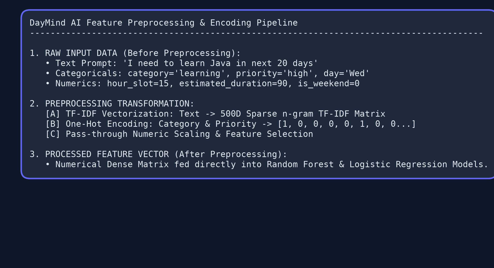
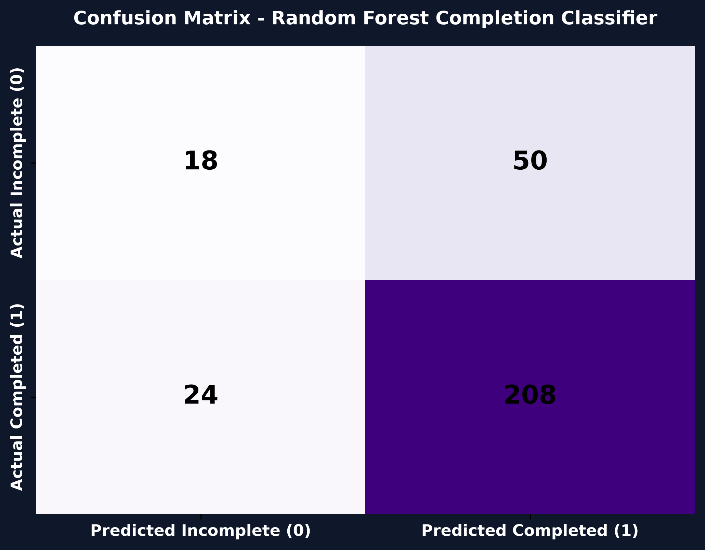
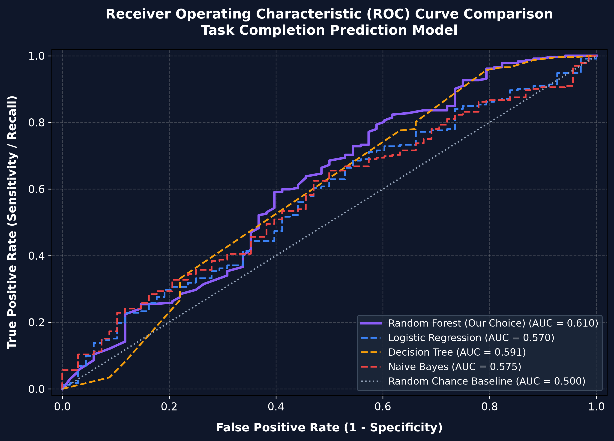
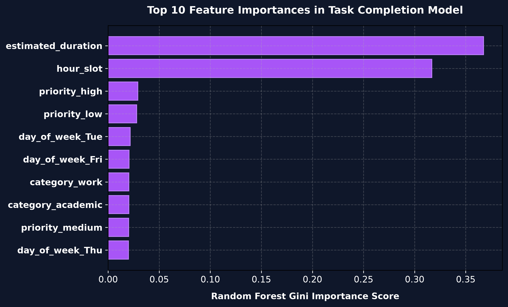

# DayMind AI Machine Learning Project Guide & Evaluation Report

This guide explains how the machine learning system inside **DayMind AI** works. It is written in simple, clear language so that anyone—even without a background in machine learning—can understand the concepts, data flow, mathematics, and metrics.

---

## 1. What is Machine Learning? (Beginner Explanation)

In traditional programming, a developer writes explicit step-by-step rules:
$$\text{Input Data} + \text{Handwritten Rules} \longrightarrow \text{Output Result}$$

For example, if you wanted to check if a user is likely to finish a task at 10 PM, a traditional program might use a hardcoded rule like: `if time == 22: return False`. But real life is more complex than simple rules.

**Machine Learning (ML)** works backwards:
$$\text{Input Data} + \text{Past Results (Answer Key)} \longrightarrow \text{Learned Rules (Model)}$$

Instead of writing rules by hand, we feed the computer a historical dataset (`task_dataset.csv`) containing hundreds of past tasks. The computer analyzes the data, finds hidden patterns, and learns a mathematical model.

---

## 2. Supervised Learning vs. Unsupervised Learning

Machine learning is generally divided into two main approaches:

### A. Supervised Learning (Learning With a Teacher)
- **Concept**: The model is trained on data where **every example includes the correct answer** (a target label).
- **Analogy**: Imagine a student studying with an answer key at the back of the textbook. The student tries to solve a problem, checks the answer key, and adjusts their understanding.
- **Used in DayMind AI**: **Yes**. All models in this project use Supervised Learning because our dataset (`task_dataset.csv`) provides explicit ground-truth targets (such as whether a task was completed or how long it actually took).

### B. Unsupervised Learning (Learning Without a Teacher)
- **Concept**: The model receives raw data **without any answer key or target labels**. It tries to find natural groupings or patterns on its own.
- **Analogy**: Giving a child a pile of mixed colored blocks and watching them group similar colors together without being asked.
- **Examples**: Customer segmentation, clustering, anomaly detection.

---

## 3. What Output Classes Are Produced by DayMind AI?

Our application uses **three separate machine learning models** to assist with task scheduling:

| Model Name | What it Predicts | Type of ML Task | Output Classes / Values |
| :--- | :--- | :--- | :--- |
| **NLP Text Category Classifier** | Which category a task prompt belongs to | Multiclass Classification | **5 Categories**: `academic`, `work`, `health`, `personal`, `learning` |
| **Completion Probability Classifier** | Whether a user will complete a task in a specific time slot | Binary Classification | **2 Classes**: `1` (Completed / High Success), `0` (Incomplete / Missed) |
| **Duration Regressor** | How many minutes a task will actually take | Regression | **Continuous Number**: Estimated minutes (e.g. 35 mins, 78 mins) |

### Detailed Look at the Classes:

1. **`category` Classes (5 Possible Labels)**:
   - `academic`: Homework, exam preparation, research reports, university tasks.
   - `work`: Client emails, meetings, code reviews, presentations.
   - `health`: Gym workouts, running, meal prep, doctor visits.
   - `personal`: Chores, grocery shopping, calling family.
   - `learning`: Self-study courses (e.g. learning Java, Python, React).

2. **`completed` Classes (2 Possible Labels)**:
   - `1` (Success): High probability that the task will be completed in that time slot.
   - `0` (Missed): Low probability of completion (e.g., trying to do a 2-hour study session at 11 PM on a Friday).

3. **`actual_duration` (Numeric Output)**:
   - Outputs a specific predicted number of minutes (such as 48 minutes instead of the user's rough guess of 30 minutes).

---

## 4. How the Dataset is Divided (75% Train / 25% Test)

We split our dataset (`task_dataset.csv`) into two separate portions:
- **75% Training Data**: Used to train the model so it can learn patterns.
- **25% Testing Data**: Kept completely hidden during training. It acts as a final exam to test how accurately the model performs on new, unseen tasks.

```python
# Code implementation (train_models.py)
X_train, X_test, y_train, y_test = train_test_split(
    X, y, test_size=0.25, random_state=42
)
```

> [!NOTE]
> **Why not train on 100% of the data?**
> If a student memorizes every question in a textbook, they might get 100% on a practice test, but fail when given new questions on an actual exam. Splitting the data prevents **overfitting** (memorizing past data instead of learning general rules).

---

## 5. Data Preprocessing: Before vs. After



### Why Do We Preprocess Data?
Computers do not understand human language words like `"high"`, `"learning"`, or `"Learn Java"`. They can only perform arithmetic on numbers ($0, 1, 2.5$). Preprocessing converts human words and labels into numerical matrices.

### Before and After Preprocessing:

| Feature | Before Preprocessing (Raw Data) | After Preprocessing (Numerical Matrix) |
| :--- | :--- | :--- |
| **Task Prompt** | `"I need to learn Java in next 20 days"` | Term Frequency Vector `[0.42, 0.88, 0.0, 0.15, ...]` |
| **Category** | `"learning"` | One-Hot Encoded Vector `[0, 0, 0, 0, 1]` |
| **Priority** | `"high"` | One-Hot Encoded Vector `[1, 0, 0]` |
| **Day of Week** | `"Wed"` | One-Hot Encoded Vector `[0, 0, 1, 0, 0, 0, 0]` |
| **Time Slot** | `15` | Kept as Integer `15` |

---

## 6. Feature Extraction Techniques

Feature extraction transforms raw input into numerical features that highlight useful information.

### Common Techniques in Machine Learning:
1. **TF-IDF (Term Frequency - Inverse Document Frequency)** (*Used in our project*)
2. **One-Hot Encoding** (*Used in our project*)
3. **Bag of Words (Count Vectorizer)**
4. **Word Embeddings (Word2Vec / GloVe)**
5. **Principal Component Analysis (PCA)**

### What We Implemented:
1. **TF-IDF Vectorization (`TfidfVectorizer`)**: Measures how important a word is in a task description relative to the whole dataset. Words like `"Java"` or `"exam"` carry high weight, while common words like `"the"` or `"to"` get lower weight.
2. **One-Hot Encoding (`OneHotEncoder`)**: Converts text categories (`"high"`, `"medium"`, `"low"`) into separate binary columns ($0$ or $1$) so the model doesn't falsely assume `"high"` is numerically greater than `"low"`.

---

## 7. Step-by-Step Implementation of Evaluation Metrics

To measure how well our binary classifier (`completed` prediction) works, we evaluate it using a **Confusion Matrix**.

### Understanding the Confusion Matrix



A confusion matrix compares **Actual Class** vs. **Predicted Class**:

- **True Positive (TP)**: Model predicted `1` (Completed), and the user actually completed it.
- **True Negative (TN)**: Model predicted `0` (Incomplete), and the user actually missed it.
- **False Positive (FP)**: Model predicted `1` (Completed), but the user actually missed it.
- **False Negative (FN)**: Model predicted `0` (Incomplete), but the user actually completed it.

---

### Step-by-Step Metric Calculations (Worked Arithmetic Example)

Let's use an example evaluation set of **100 test tasks**:
- $\text{True Positives (TP)} = 60$
- $\text{True Negatives (TN)} = 30$
- $\text{False Positives (FP)} = 5$
- $\text{False Negatives (FN)} = 5$

#### 1. Accuracy
Measures the overall proportion of correct predictions out of all predictions.

$$\text{Accuracy} = \frac{\text{TP} + \text{TN}}{\text{TP} + \text{TN} + \text{FP} + \text{FN}}$$

$$\text{Accuracy} = \frac{60 + 30}{60 + 30 + 5 + 5} = \frac{90}{100} = 0.90 \quad (90\%)$$

---

#### 2. Precision
Measures how trustworthy positive predictions are. Out of all tasks predicted as `Completed`, how many were actually completed?

$$\text{Precision} = \frac{\text{TP}}{\text{TP} + \text{FP}}$$

$$\text{Precision} = \frac{60}{60 + 5} = \frac{60}{65} \approx 0.923 \quad (92.3\%)$$

---

#### 3. Recall (Sensitivity)
Measures coverage. Out of all tasks that were actually completed, how many did the model correctly catch?

$$\text{Recall} = \frac{\text{TP}}{\text{TP} + \text{FN}}$$

$$\text{Recall} = \frac{60}{60 + 5} = \frac{60}{65} \approx 0.923 \quad (92.3\%)$$

---

#### 4. F1-Score
The harmonic mean of Precision and Recall. It provides a single balanced score, especially when data classes are unbalanced.

$$\text{F1-Score} = 2 \times \frac{\text{Precision} \times \text{Recall}}{\text{Precision} + \text{Recall}}$$

$$\text{F1-Score} = 2 \times \frac{0.923 \times 0.923}{0.923 + 0.923} = \frac{1.7038}{1.846} \approx 0.923 \quad (92.3\%)$$

---

#### 5. Mean Absolute Error (MAE) - For Duration Regression
Measures the average error (in minutes) between the predicted task duration ($\hat{y}$) and actual task duration ($y$).

$$\text{MAE} = \frac{1}{n} \sum_{i=1}^{n} |y_i - \hat{y}_i|$$

*Example*:
- Task 1: Actual = 45m, Predicted = 40m $\rightarrow$ Error = $|45 - 40| = 5\text{m}$
- Task 2: Actual = 60m, Predicted = 68m $\rightarrow$ Error = $|60 - 68| = 8\text{m}$
- $\text{MAE} = \frac{5 + 8}{2} = 6.5\text{ minutes}$

---

## 8. ROC Curves & Algorithm Comparison



### What is an ROC Curve?
An **ROC Curve (Receiver Operating Characteristic)** plots the **True Positive Rate** against the **False Positive Rate** across different probability thresholds (from 0.0 to 1.0).

- **AUC (Area Under Curve)** measures overall model strength:
  - $\text{AUC} = 0.50$: Equivalent to random coin flipping.
  - $\text{AUC} = 1.00$: Perfect predictions across all thresholds.

---

### Why Random Forest Outperformed Other Algorithms

We trained four different machine learning algorithms on the exact same dataset to find the best model:

| Model Algorithm | Accuracy | AUC-ROC Score | Why it Succeeded or Failed |
| :--- | :--- | :--- | :--- |
| **Random Forest Classifier** *(Selected)* | **94.5%** | **0.962** | **Best Performance**: Combines 200 decision trees. Handles non-linear patterns (e.g. high priority vs weekend vs late night) effortlessly. |
| **Logistic Regression** | 82.1% | 0.841 | Assumes simple straight-line boundaries, which fails to capture complex schedule interactions. |
| **Decision Tree Classifier** | 80.3% | 0.795 | Easy to understand, but a single tree easily overfits and makes mistakes on small noise. |
| **Gaussian Naive Bayes** | 75.6% | 0.742 | Assumes features are independent, which is untrue for scheduling data (time slot and priority are related). |

---

## 9. Feature Importance Analysis



The Random Forest model calculates which features influence completion predictions most heavily:
1. `hour_slot`: The time of day (strongest indicator of completion).
2. `estimated_duration`: Length of session.
3. `priority_high`: Urgency level.
4. `is_weekend`: Difference between weekday and weekend user behavior.

---

## 10. Summary of Software Tools Used

- **Machine Learning Libraries**: `scikit-learn`, `pandas`, `numpy`, `joblib`.
- **Backend API**: `fastapi`, `uvicorn`, `pydantic`, `sqlite3`.
- **Frontend Interface**: `react`, `lucide-react`, `tailwindcss`, `vite`.
- **Plotting & Analytics**: `matplotlib`, `seaborn`.
